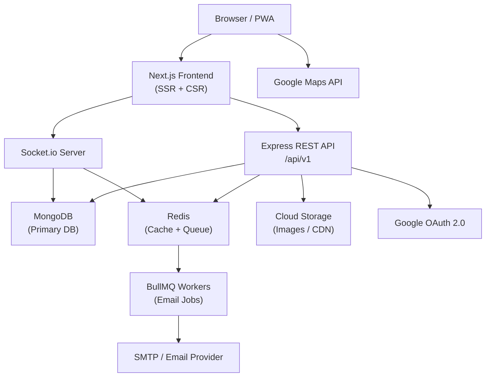

# Design Document: AGAINO Marketplace Platform

## Overview

AGAINO is a production-ready, full-stack buy & sell marketplace web application — a modern online classifieds platform similar to OLX. The platform enables users to list, discover, and transact on second-hand or new products locally, with a focus on speed, simplicity, trust, and scalability.

The system is composed of six primary runtime services:

- **Next.js Frontend** — SSR/SSG pages, PWA, i18n, real-time UI
- **Node.js/Express REST API** — business logic, auth, listings, chat persistence
- **MongoDB** — primary data store with geospatial and full-text indexes
- **Redis** — caching layer and BullMQ job queue backing store
- **Socket.io Server** — real-time chat and in-app notifications
- **BullMQ Workers** — async email delivery and background jobs

### Key Design Principles

- **Clean Architecture / MVC**: strict separation of routes → controllers → services → repositories
- **Stateless API**: JWT-based auth; no server-side session state
- **Async-first**: all side effects (email, notifications) are enqueued, never blocking the request path
- **Cache-aside pattern**: Redis caches hot reads; writes always invalidate affected keys
- **Security by default**: Zod validation, rate limiting, MIME verification, XSS sanitization, CSRF tokens on every state-changing request

---

## Architecture

### High-Level System Diagram



### Request Flow

1. Browser requests a listing detail page → Next.js SSR fetches from API → returns fully rendered HTML (SEO)
2. Browser requests feed/search → Next.js CSR calls API → API checks Redis → on miss, queries MongoDB → caches result → returns JSON
3. User publishes listing → API persists to MongoDB → invalidates Redis keys → enqueues BullMQ email job → returns 201
4. BullMQ worker picks up job → sends email via SMTP → marks job complete (retries on failure)
5. User sends chat message → Socket.io event → persisted to MongoDB → delivered to recipient socket in real time

### Folder Structure

```
/
├── frontend/                    # Next.js application
│   ├── app/                     # App Router pages
│   ├── components/              # Shared UI components (ShadCN + custom)
│   ├── hooks/                   # Custom React hooks
│   ├── lib/                     # API client, socket client, utils
│   ├── public/                  # Static assets, manifest.json, sw.js
│   └── messages/                # i18n locale files (en.json, ...)
│
├── backend/                     # Express API
│   ├── src/
│   │   ├── config/              # DB, Redis, env config
│   │   ├── middleware/          # Auth, rate-limit, error handler, CSRF
│   │   ├── modules/
│   │   │   ├── auth/            # routes, controller, service, repository
│   │   │   ├── listings/
│   │   │   ├── chat/
│   │   │   ├── search/
│   │   │   ├── notifications/
│   │   │   ├── reports/
│   │   │   ├── wishlist/
│   │   │   ├── admin/
│   │   │   └── images/
│   │   ├── jobs/                # BullMQ queue definitions and workers
│   │   ├── socket/              # Socket.io event handlers
│   │   └── utils/               # Zod schemas, helpers, logger
│   └── tests/
│
├── docker-compose.yml
├── .github/workflows/ci.yml
└── .env.example
```

---

## Components and Interfaces

### 1. Auth Service

Handles registration, login, JWT issuance, refresh token rotation, Google OAuth, and password reset.

**Endpoints:**
```
POST /api/v1/auth/register
POST /api/v1/auth/verify-otp
POST /api/v1/auth/login
POST /api/v1/auth/refresh
POST /api/v1/auth/logout
POST /api/v1/auth/forgot-password
POST /api/v1/auth/reset-password
GET  /api/v1/auth/google
GET  /api/v1/auth/google/callback
```

**Token Strategy:**
- Access token: JWT, 15-minute expiry, signed with `ACCESS_TOKEN_SECRET`
- Refresh token: opaque UUID stored in MongoDB `refresh_tokens` collection, 7-day expiry
- On refresh: old token is deleted and a new one is issued (rotation)
- On logout: all refresh tokens for the user are deleted

**OTP Flow:**
- 6-digit numeric OTP generated with `crypto.randomInt`
- Stored hashed in MongoDB with a 10-minute TTL index
- Delivered via BullMQ email job (non-blocking)

### 2. Listing Service

Manages the full product lifecycle: Draft → Published → Sold/Archived.

**Endpoints:**
```
POST   /api/v1/listings                    # create (Draft)
GET    /api/v1/listings                    # public feed (Published only)
GET    /api/v1/listings/:id                # detail (SSR-friendly)
PATCH  /api/v1/listings/:id                # update (owner only)
DELETE /api/v1/listings/:id                # soft-delete → Archived
PATCH  /api/v1/listings/:id/publish        # Draft → Published
PATCH  /api/v1/listings/:id/sold           # Published → Sold
GET    /api/v1/listings/my                 # owner's own listings (all statuses)
```

**Status Transition Guard:**
```
Draft → Published (owner action)
Published → Sold (owner action)
Published → Archived (owner delete or expiry job)
Draft → Archived (owner delete)
Archived → Published (admin only)
```

Any transition not in this map returns 400 Bad Request.

**Expiry Job:** A BullMQ repeatable job runs every hour, querying for Published listings past their `expiresAt` date and setting them to Archived.

### 3. Search Service

Full-text search backed by MongoDB Atlas Search (or `$text` index for self-hosted).

**Endpoint:**
```
GET /api/v1/search?q=&category=&minPrice=&maxPrice=&condition=&lat=&lng=&radius=&sort=&page=&limit=
```

**Autocomplete:**
```
GET /api/v1/search/autocomplete?q=
```
- Returns up to 10 suggestions from a dedicated `search_suggestions` collection updated on listing publish
- Response cached in Redis with 60-second TTL
- Target: < 300ms p95

**Geospatial Filter:** Uses MongoDB `$geoWithin` / `$nearSphere` on a `2dsphere` index on `listing.location.coordinates`.

**Sort Options:** `newest`, `price_asc`, `price_desc`, `relevance`

**Featured Boost:** Featured listings are prepended to results before relevance sorting is applied.

### 4. Chat Service (Socket.io)

Real-time bidirectional messaging tied to listing conversations.

**Socket Events (client → server):**
```
join_conversation   { conversationId }
send_message        { conversationId, content, type: 'text'|'image' }
typing_start        { conversationId }
typing_stop         { conversationId }
mark_read           { conversationId, messageId }
```

**Socket Events (server → client):**
```
new_message         { message }
typing              { userId, conversationId }
message_read        { messageId, readAt }
notification        { type, payload }
```

**REST Endpoints (history):**
```
GET  /api/v1/conversations                 # list user's conversations
GET  /api/v1/conversations/:id/messages    # paginated message history
POST /api/v1/conversations                 # start conversation (links to listing)
```

**Rooms:** Each conversation maps to a Socket.io room named `conv:{conversationId}`. Users join their rooms on connection.

### 5. Notification Service

Handles both in-app (WebSocket) and email (BullMQ) notifications.

**Email Queue Jobs (BullMQ):**
| Job Name | Trigger | Recipient |
|---|---|---|
| `admin.listing.published` | Listing published | Admin email |
| `admin.listing.sold` | Listing marked sold | Admin email |
| `admin.report.created` | Report submitted | Admin email |
| `admin.user.registered` | New user signup | Admin email |

**Retry Policy:** 3 attempts, exponential backoff (2s, 4s, 8s). Failed jobs move to a dead-letter queue for inspection.

**In-App Events (Socket.io):**
- `new_message` → emitted to recipient's user room `user:{userId}`
- `listing_status_changed` → emitted to listing owner
- `notification` → generic event for other alerts

### 6. Image Service

Handles secure upload, validation, optimization, and CDN delivery.

**Upload Flow:**
1. Multer receives multipart/form-data (memory storage, 5 MB limit per file)
2. MIME type verified by reading file magic bytes (not just extension)
3. Sharp resizes to max 1200px width, generates 300px thumbnail, converts to WebP
4. Both versions uploaded to cloud storage (e.g., AWS S3 / GCS)
5. CDN URLs stored in listing document

**Validation:**
- Accepted formats: JPEG, PNG, WebP
- Max file size: 5 MB per file
- Max files per listing: 10
- Rejected formats return 415; oversized files return 413

### 7. Admin Service

Restricted to `somasrinivaspasupuleti47@gmail.com` via `requireAdmin` middleware.

**Endpoints:**
```
GET    /api/v1/admin/stats
GET    /api/v1/admin/users
PATCH  /api/v1/admin/users/:id/block
PATCH  /api/v1/admin/users/:id/unblock
GET    /api/v1/admin/listings
PATCH  /api/v1/admin/listings/:id/approve
PATCH  /api/v1/admin/listings/:id/reject
DELETE /api/v1/admin/listings/:id
PATCH  /api/v1/admin/listings/:id/restore
PATCH  /api/v1/admin/listings/:id/sold
PATCH  /api/v1/admin/listings/:id/featured
GET    /api/v1/admin/reports
PATCH  /api/v1/admin/reports/:id
```

### 8. Wishlist Service

```
POST   /api/v1/wishlist/:listingId    # add
DELETE /api/v1/wishlist/:listingId    # remove
GET    /api/v1/wishlist               # list (Published only)
```

Unique compound index on `(userId, listingId)` prevents duplicates at the DB level.

### 9. Report Service

```
POST /api/v1/reports          # create report
```

Unique compound index on `(reporterId, listingId)` enforces one-report-per-user-per-listing.

---

## Data Models

### User

```typescript
interface User {
  _id: ObjectId;
  email: string;           // unique, indexed
  displayName: string;
  passwordHash: string;    // bcrypt, cost 12
  role: 'user' | 'admin';
  isVerified: boolean;
  isBlocked: boolean;
  googleId?: string;
  avatar?: string;
  createdAt: Date;
  updatedAt: Date;
}
```

### OTP

```typescript
interface OTP {
  _id: ObjectId;
  userId: ObjectId;
  codeHash: string;
  expiresAt: Date;         // TTL index, 10 minutes
  createdAt: Date;
}
```

### RefreshToken

```typescript
interface RefreshToken {
  _id: ObjectId;
  userId: ObjectId;        // indexed
  token: string;           // unique, indexed
  expiresAt: Date;         // TTL index, 7 days
  createdAt: Date;
}
```

### Listing

```typescript
interface Listing {
  _id: ObjectId;
  sellerId: ObjectId;      // ref: User, indexed
  title: string;           // max 100 chars, text-indexed
  description: string;     // max 2000 chars, text-indexed
  price: number;           // non-negative
  category: string;        // indexed
  subcategory: string;
  condition: 'new' | 'used';
  status: 'draft' | 'published' | 'sold' | 'archived';
  isFeatured: boolean;     // indexed
  images: {
    original: string;      // CDN URL
    thumbnail: string;     // CDN URL
    webp: string;          // CDN URL
  }[];
  location: {
    city: string;
    region: string;
    coordinates?: {
      type: 'Point';
      coordinates: [number, number]; // [lng, lat]
    };
  };
  expiresAt?: Date;
  viewCount: number;
  createdAt: Date;
  updatedAt: Date;
}
// Indexes:
// { status: 1, createdAt: -1 }
// { status: 1, isFeatured: -1, createdAt: -1 }
// { sellerId: 1, status: 1 }
// { category: 1, status: 1 }
// { "location.coordinates": "2dsphere" }
// { title: "text", description: "text" }
```

### Conversation

```typescript
interface Conversation {
  _id: ObjectId;
  listingId: ObjectId;     // ref: Listing, indexed
  participants: ObjectId[]; // [buyerId, sellerId], indexed
  lastMessage?: {
    content: string;
    sentAt: Date;
    senderId: ObjectId;
  };
  createdAt: Date;
  updatedAt: Date;
}
// Unique index: { listingId: 1, participants: 1 }
```

### Message

```typescript
interface Message {
  _id: ObjectId;
  conversationId: ObjectId; // indexed
  senderId: ObjectId;
  content: string;
  type: 'text' | 'image';
  imageUrl?: string;
  isRead: boolean;
  readAt?: Date;
  createdAt: Date;
}
// Index: { conversationId: 1, createdAt: 1 }
```

### Notification

```typescript
interface Notification {
  _id: ObjectId;
  userId: ObjectId;        // indexed
  type: string;            // e.g. 'new_message', 'listing_sold'
  payload: Record<string, unknown>;
  isRead: boolean;
  createdAt: Date;
}
// Index: { userId: 1, isRead: 1, createdAt: -1 }
// TTL index: { createdAt: 1 }, expireAfterSeconds: 2592000 (30 days)
```

### Report

```typescript
interface Report {
  _id: ObjectId;
  listingId: ObjectId;     // indexed
  reporterId: ObjectId;
  reason: 'spam' | 'fraud' | 'inappropriate' | 'duplicate' | 'other';
  description?: string;
  status: 'pending' | 'reviewed' | 'dismissed';
  createdAt: Date;
}
// Unique index: { reporterId: 1, listingId: 1 }
```

### Wishlist

```typescript
interface WishlistEntry {
  _id: ObjectId;
  userId: ObjectId;        // indexed
  listingId: ObjectId;
  createdAt: Date;
}
// Unique index: { userId: 1, listingId: 1 }
```

### Redis Key Conventions

| Key Pattern | TTL | Description |
|---|---|---|
| `feed:home:{page}` | 5 min | Homepage feed pages |
| `feed:category:{cat}:{page}` | 5 min | Category feed pages |
| `search:{hash(query)}` | 5 min | Search result pages |
| `autocomplete:{prefix}` | 60 sec | Autocomplete suggestions |
| `listing:{id}` | 5 min | Individual listing detail |
| `user:{id}:wishlist` | 5 min | User wishlist |

Cache invalidation: on any listing write (create/update/delete/status change), all `feed:*`, `search:*`, and `listing:{id}` keys are deleted using Redis `SCAN` + `DEL` or key tagging.

